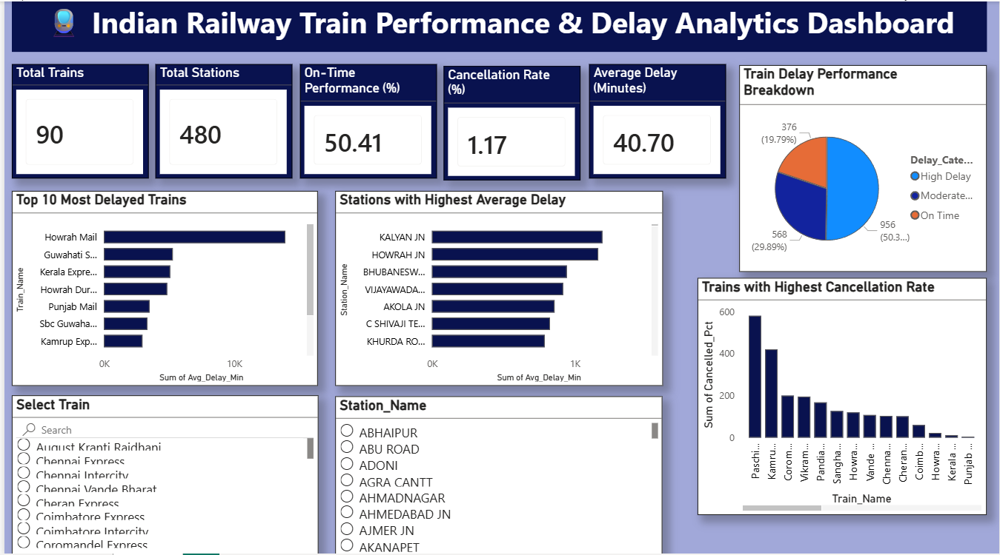

# 🚆 Indian Railway Delay Analysis

---

## 📌 Overview

This project analyzes delays in the Indian railway network to uncover patterns, identify high-delay routes, and understand factors affecting train punctuality. Using **SQL (MS SQL Server)** and **Power BI**, the project transforms raw railway data into actionable insights for performance improvement.

---

## 🛠️ Tech Stack

  
  
  

* **SQL (MS SQL Server)** → Data extraction, cleaning, and transformation
* **Power BI** → Data visualization and dashboard development

---

## 📊 Project Workflow

### 1️⃣ Data Collection

* Collected dataset containing train schedules and delay information
* Key fields include: Train Name, Source, Destination, Arrival Time, Departure Time, Delay Duration, Date

---

### 2️⃣ Data Cleaning (SQL)

* Removed duplicate and inconsistent records
* Handled missing delay values
* Standardized time formats and date fields

---

### 3️⃣ Data Transformation (SQL)

* Created calculated columns (delay categories, peak hours)
* Aggregated data (route-wise, station-wise, monthly trends)
* Applied joins and window functions for deeper insights

---

### 4️⃣ Data Analysis

Key questions explored:

* Which trains/routes experience the highest delays?
* What are the peak delay hours?
* Which stations contribute most to delays?
* Are there seasonal patterns in delays?

---

### 5️⃣ Data Visualization (Power BI)

* Developed interactive dashboards
* Implemented slicers for filtering by route, station, and date
* Key visuals include:

  * Delay distribution charts
  * Route-wise delay comparison
  * Station performance analysis
  * Monthly and hourly delay trends

---

## 📈 Key Insights

* 📌 Certain routes consistently show higher delays
* 📌 Peak delays occur during high-traffic hours
* 📌 Major junctions contribute significantly to delays
* 📌 Seasonal factors impact train punctuality

---

## 🚀 How to Use

1. Clone this repository
2. Run SQL scripts in **MS SQL Server**
3. Load processed data into **Power BI**
4. Open the `.pbix` file to explore dashboards

---

## 🎯 Project Highlights

✔ End-to-end data analytics workflow
✔ Real-world transportation problem
✔ Strong SQL data transformation techniques
✔ Interactive Power BI dashboard

---

## 🙌 Future Improvements

* Integrate real-time railway API data
* Predict delays using machine learning
* Add weather and traffic correlation analysis

---

## ⭐ Support

If you found this project useful, consider giving it a **star ⭐**

---

## 👨‍💻 Author

**Avranil Dutta**
